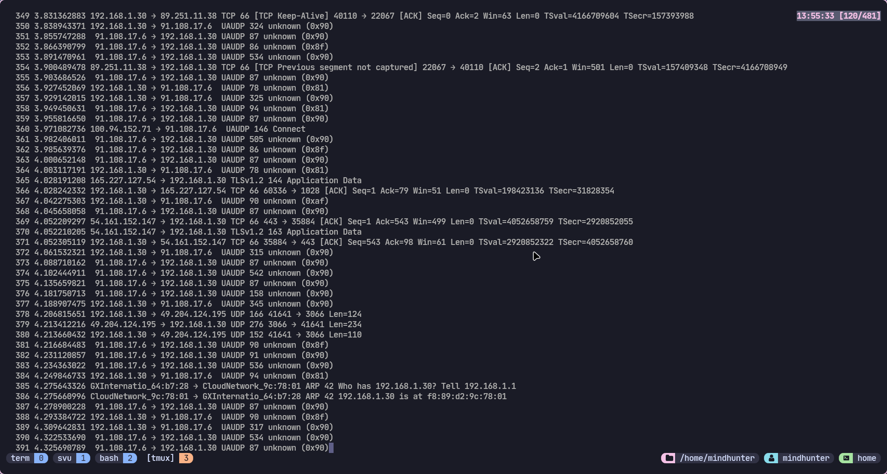

# Day 1: Nmap Basics

## Installation 

Installation of nmap was relatively simple since I use Arch Linux as my daily driver. The tool was obtained from the official repository with the following command:  

```yay -S nmap```


## Local IP Range 

I used the ip command to find the local ip address of my network interface: 

```ip addr show wlan0```

My local IP range was discovered to be 192.168.1.0/24. This is the CIDR notation that is now widely used which reveals my subnet mask to be 255.255.255.0. I performed a simple TCP SYN scan with the given nmap command: 

```nmap -sS 192.168.1.0/24 -o tcp_scan```

A SYN scan is use to enumerate open ports faster because it does not perform a three-way TCP handshake. Using ```-sT``` instead would try to perform a three way handshake with every given port. A UDP scan was also performed with the command: 

```nmap -sU 192.168.1.0/24 -o udp_scan``` 

The discovered ips and open ports can be found the text files. 

## Packet Capture with Tshark (terminal based wireshark) 

 

I performed a packet capture using tshark with the command ```tshark -i wlan0```. I analyzed the incoming and outgoing packets while browsing various sites.


## References 

- https://youtu.be/RczRjuojBHs - Nmap TCP Connect & Stealth Scanning 
- https://youtu.be/yL2ZJa8fCEE - Nmap Mastery 
- https://youtu.be/HoYgPlmOZgo - Tshark tutorial


